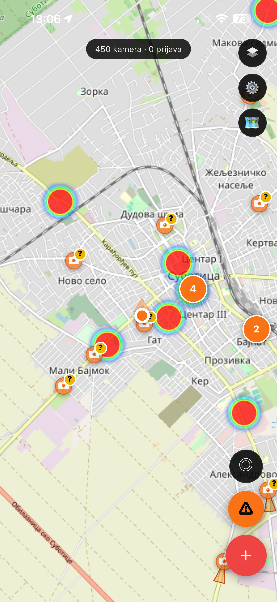
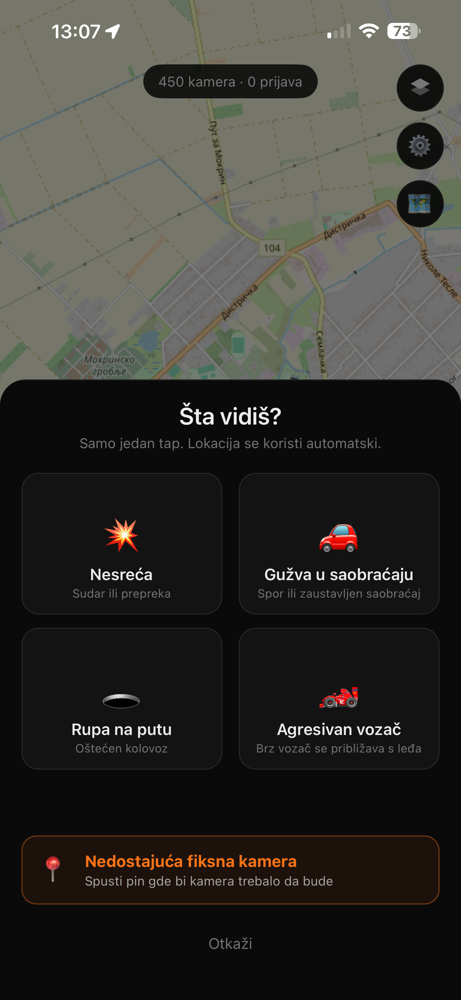
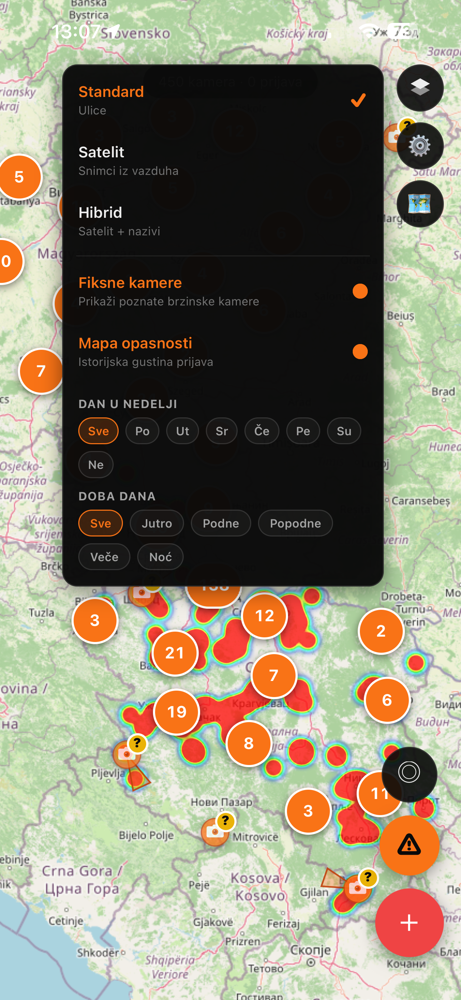
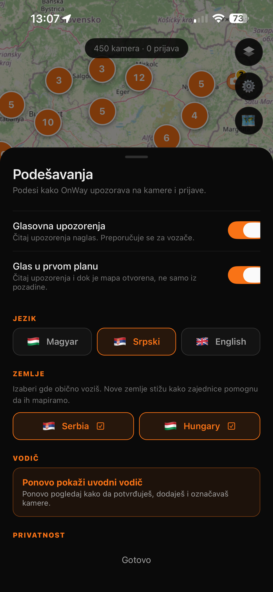
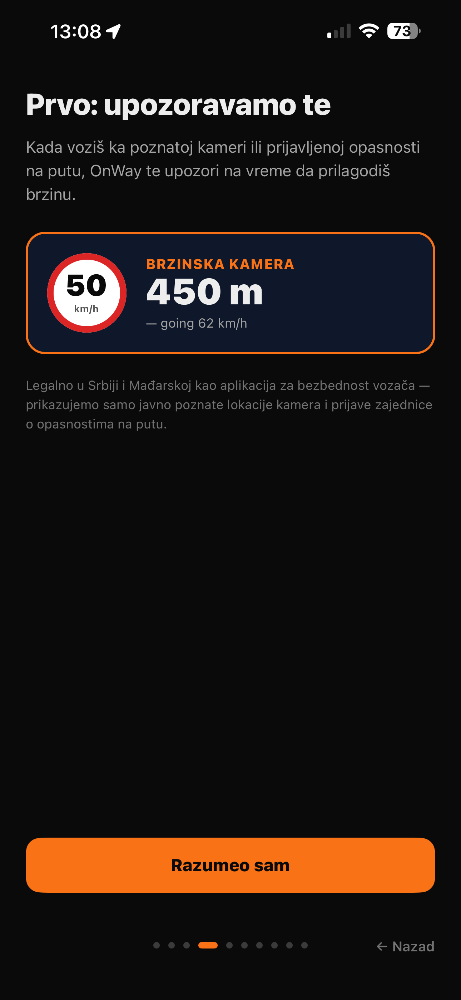

# OnWay

**Community-driven driver safety app for Serbia and Hungary.**

Stay alert to known speed cameras and live road hazards reported by other drivers. Built together by the community — every driver makes the map better for the next one.

  
  
  

---

## 🚗 Join the closed testing

OnWay is in **closed testing** before its public Google Play release. We're looking for drivers in **Serbia** and **Hungary** who'd like to try the app early and help us polish it before launch.

Google Play requires a closed testing round with **12 testers minimum for 14 days** before we can release publicly — that's the phase we're in right now. Your help genuinely unblocks the launch.

### What you'll do

- **Install OnWay** on your Android phone via a special Google Play link we'll send you
- **Use it for a few weeks** while driving normally — no extra effort
- **Report any bugs or weird behavior** by email (optional, but hugely appreciated)
- That's it — no forms, no meetings, no reports

### How to sign up

Send an email to **[onway.help@proton.me](mailto:onway.help@proton.me?subject=OnWay%20tester)** with:

1. Subject: **`OnWay tester`**
2. Your first name
3. **The Google account email** you use on your Android phone's Play Store (this must match — Google ties tester access to this email)
4. Which country you're based in (Serbia or Hungary)

You'll get a reply within a day with a **Play Store opt-in link**. Tap it on your phone, join the tester list, then OnWay appears in your Play Store under "Installed as tester" — install it like any other app.

> **Note:** OnWay is currently **Android only**. iOS version is coming after the Android launch.

---

## 🗺 What OnWay actually does

  
  
  

- **Known speed camera map** for Serbia and Hungary, sourced from publicly available municipal and national traffic-authority lists
- **Live road hazard reports** — accidents, traffic jams, potholes, and general warnings from other drivers, visible on the map in real time
- **Voice + on-screen alerts** when you approach a known camera or reported hazard ahead
- **Community heatmap** showing where hazards tend to be, filtered by day of week and time of day
- **Anonymous by default** — no sign-up, no email, no phone number required. Set an optional nickname if you want credit for your contributions
- **Delete my data** anytime from Settings → Privacy
- **Three languages** — English, Hungarian, Serbian, switchable in-app

**OnWay is a Points of Interest (POI) awareness app**, not a signal-detection device. It uses only publicly available traffic-camera positions and community-submitted reports. Legal for use in Serbia and Hungary as a driver safety aid.

---

## 🇭🇺 Magyar

### Csatlakozz a zárt teszteléshez

Az OnWay a publikus Google Play kiadás előtt **zárt tesztelésben** van. Szerbiai és magyarországi sofőröket keresünk, akik előzetesen kipróbálnák az alkalmazást és segítenének a finomhangolásában.

A Google Play megköveteli, hogy **legalább 12 tesztelővel 14 napig** fusson egy zárt tesztelés, mielőtt publikálhatjuk — ez az a fázis, amiben most vagyunk. A segítséged tényleg kulcsfontosságú a launchhoz.

#### Mit kell csinálnod

- **Telepítsd az OnWay-t** az Android telefonodra egy speciális Google Play linken keresztül, amit elküldünk
- **Használd pár hétig** vezetés közben, ahogy egyébként is — nem kell extra erőfeszítés
- **Jelezd ha valamibe hibát/furcsaságot találsz** emailben (opcionális, de nagyon értékeljük)
- Ennyi — nincsenek űrlapok, meetingek, riportok

#### Hogyan jelentkezz

Küldj emailt a **[onway.help@proton.me](mailto:onway.help@proton.me?subject=OnWay%20tester)** címre ezzel:

1. Tárgy: **`OnWay tester`**
2. A keresztneved
3. **A Google-fiók email címe**, amit a telefonod Play Store-ján használsz (ennek pontosan egyeznie kell — a Google a tesztelői hozzáférést ehhez köti)
4. Ország: Szerbia vagy Magyarország

Egy napon belül kapsz egy **Play Store opt-in linket**. A telefonodon rákattintasz, feliratkozol a tesztelői listára, és az OnWay megjelenik a Play Store-odban a "Tesztelőként telepítve" kategóriában — onnan ugyanúgy telepíthető mint bármely másik app.

> **Megjegyzés:** az OnWay jelenleg **csak Android**. Az iOS verzió az Android launch után jön.

#### Mit tud az OnWay

- **Fix sebességmérő térkép** Szerbiára és Magyarországra, publikusan elérhető önkormányzati és országos közlekedési hatósági adatokból
- **Valós idejű útveszély-bejelentések** — balesetek, forgalmi dugók, kátyúk, általános veszélyek más sofőrök által megjelölve
- **Hangos és képernyős riasztások** amikor ismert kamerához vagy bejelentett veszélyhez közeledsz
- **Közösségi hőtérkép** — melyik terület mikor a legveszélyesebb, nap és napszak szerint szűrve
- **Alapból anonim** — nincs regisztráció, email, telefonszám. Opcionális becenév ha szeretnél elismerést a hozzájárulásaidért
- **Adataim törlése** bármikor a Beállítások → Adatvédelem menüből
- **Három nyelv** — angol, magyar, szerb, appon belül váltható

Az OnWay egy **POI (érdekes pont) figyelmeztető alkalmazás**, nem jelérzékelő eszköz. Kizárólag publikusan elérhető kamerapozíciókat és közösségi bejelentéseket használ. Szerbiában és Magyarországon jogszerűen használható, mint vezetésbiztonsági segédeszköz.

---

## 🇷🇸 Srpski

### Pridruži se zatvorenom testiranju

OnWay je u **fazi zatvorenog testiranja** pre javnog izlaska na Google Play. Tražimo vozače iz **Srbije** i **Mađarske** koji bi isprobali aplikaciju unapred i pomogli nam da je doteramo pre zvaničnog lansiranja.

Google Play zahteva da zatvoreno testiranje ima **najmanje 12 testera u trajanju od 14 dana** pre javnog izdanja — to je faza u kojoj smo sad. Tvoja pomoć nam stvarno odblokira lansiranje.

#### Šta treba da radiš

- **Instaliraj OnWay** na svoj Android telefon preko posebnog linka sa Google Play-a koji ćemo ti poslati
- **Koristi ga par nedelja** dok voziš kao i inače — nema dodatnog napora
- **Javi nam ako naiđeš na bug ili čudno ponašanje** emailom (opciono, ali jako cenimo)
- To je sve — nema formulara, sastanaka, izveštaja

#### Kako da se prijaviš

Pošalji email na **[onway.help@proton.me](mailto:onway.help@proton.me?subject=OnWay%20tester)** sa:

1. Naslov: **`OnWay tester`**
2. Tvoje ime
3. **Email Google naloga** koji koristiš na Play Store-u svog Android telefona (mora tačno da se poklopi — Google vezuje pristup testeru za taj email)
4. Zemlja: Srbija ili Mađarska

U roku od dana dobićeš odgovor sa **Play Store opt-in linkom**. Tapneš ga na telefonu, pridružiš se listi testera, i OnWay se pojavi u tvom Play Store-u u kategoriji "Instalirano kao tester" — odatle se instalira kao i svaka druga aplikacija.

> **Napomena:** OnWay je trenutno **samo za Android**. iOS verzija dolazi posle Android lansiranja.

#### Šta OnWay radi

- **Mapa poznatih fiksnih brzinskih kamera** za Srbiju i Mađarsku, iz javno dostupnih podataka opštinskih i državnih saobraćajnih organa
- **Prijave opasnosti na putu u realnom vremenu** — nezgode, gužve, rupe na putu, opšte opasnosti od drugih vozača
- **Glasovna i ekranska upozorenja** kada se približavaš poznatoj kameri ili prijavljenoj opasnosti
- **Mapa gustine zajednice** — koja područja su najopasnija, filtrirano po danu u nedelji i dobu dana
- **Podrazumevano anoniman** — bez registracije, email-a, broja telefona. Opcionalni nadimak ako želiš priznanje za svoje doprinose
- **Obriši moje podatke** u bilo kom trenutku iz Podešavanja → Privatnost
- **Tri jezika** — engleski, mađarski, srpski, prebacivanje u aplikaciji

OnWay je **POI (tačke od interesa) aplikacija za upozoravanje**, ne uređaj za detekciju signala. Koristi isključivo javno dostupne pozicije saobraćajnih kamera i prijave zajednice. Legalan za upotrebu u Srbiji i Mađarskoj kao pomoć za bezbednost vozača.

---

## 📄 Legal documents

- **Privacy policy** — [English](privacy-policy-en.md) · [Magyar](privacy-policy-hu.md) · [Srpski](privacy-policy-sr.md)
- **Terms of service** — [English](terms-of-service-en.md) · [Magyar](terms-of-service-hu.md) · [Srpski](terms-of-service-sr.md)
- **Imprint** — [English](imprint-en.md) · [Magyar](imprint-hu.md) · [Srpski](imprint-sr.md)
- **Data deletion request** — [account-deletion](account-deletion.md)

**Contact:** [onway.help@proton.me](mailto:onway.help@proton.me)

---

Built by Malatenski David (Serbia). OnWay is a non-commercial project by an independent developer.
